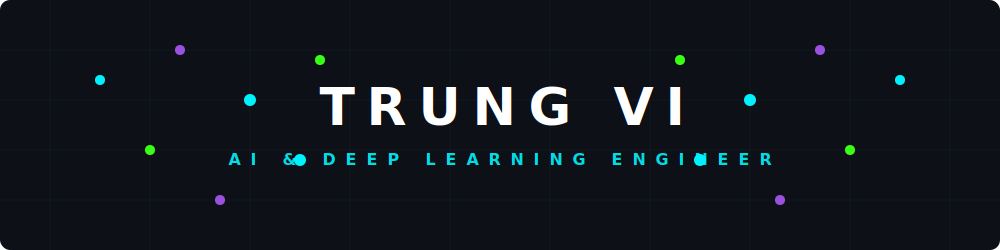

  

  

  
  
  

---

### 
🛠️ Tech Stack

#### 🧠 Deep Learning & Machine Learning

#### 🚀 Large Language Models & GenAI

#### ⚙️ MLOps & Infrastructure

#### 💻 Languages & Core Environments

---

### 
📊 GitHub Statistics

  <table align="center" border="0" cellpadding="0" cellspacing="0">
    <tr>
      <td valign="top" width="50%">
        
      </td>
      <td valign="top" width="50%">
        
      </td>
    </tr>
  </table>

  

---

  <i>"The best way to predict the future is to invent it."</i> 
  💡 Feel free to reach out if you want to collaborate on AI/ML projects!

